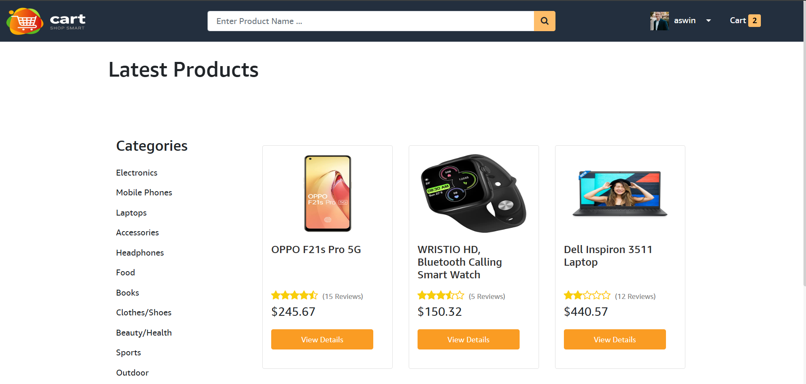
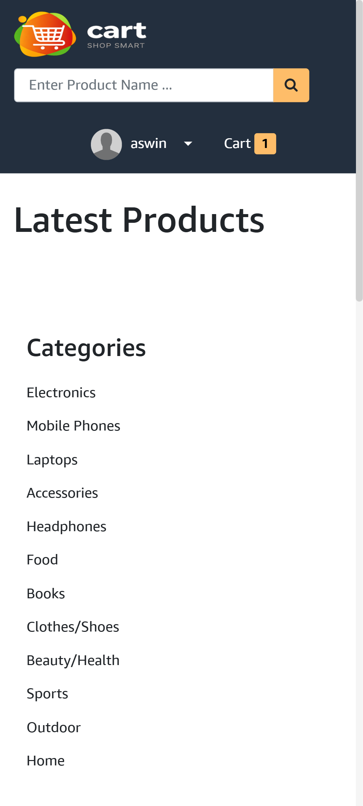
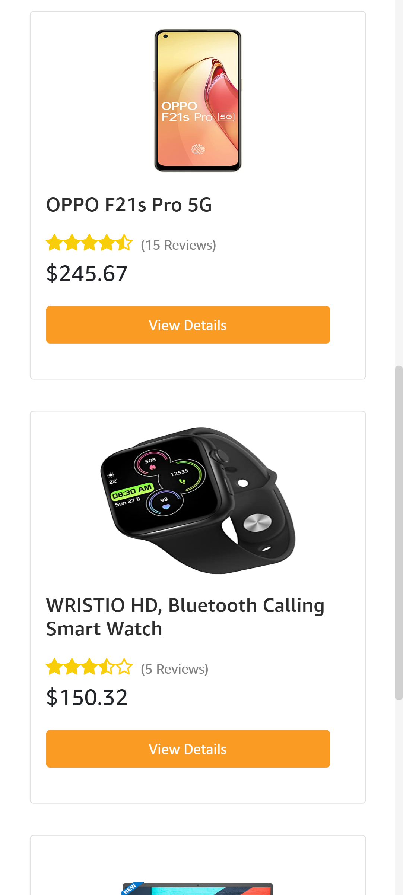
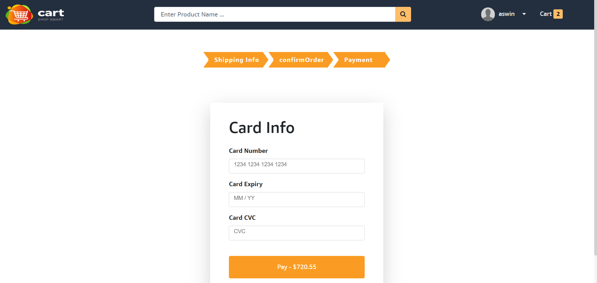
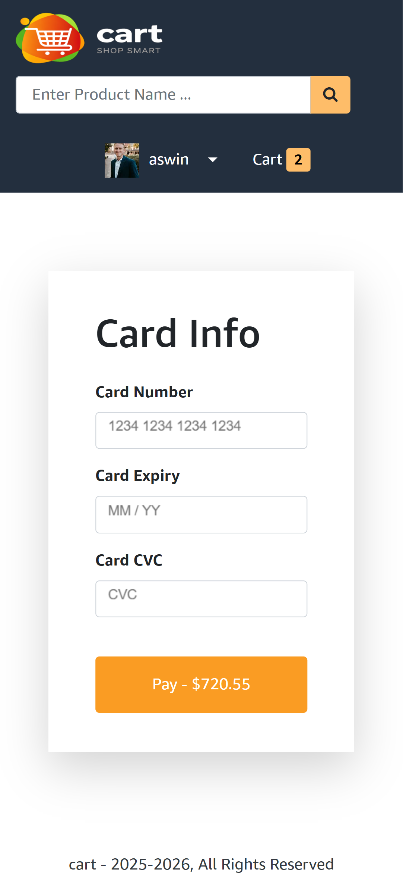
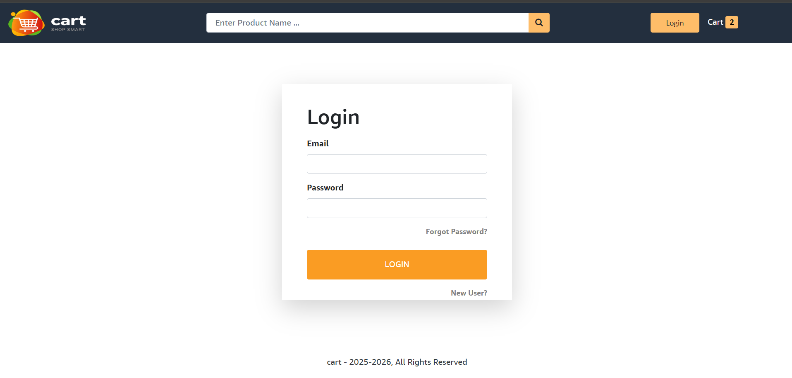
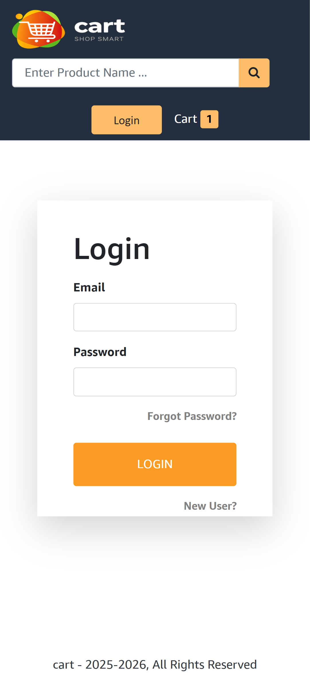
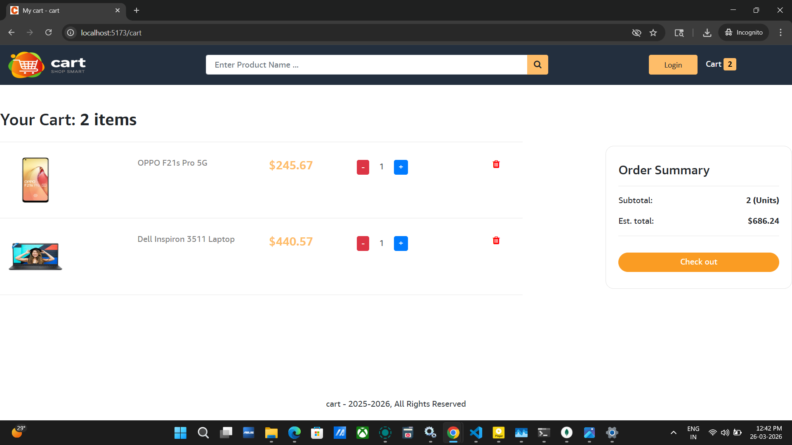
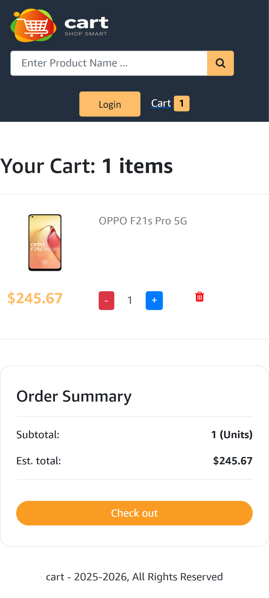

# 🛒 Cart - Shop Smart | Full-Stack E-Commerce

A modern, responsive E-commerce platform built with the **MERN Stack**. This project features a complete shopping workflow, from product discovery and advanced filtering to secure Stripe-integrated checkout and user profile management.

---

## 🚀 Live Demo
**[➜ View Live Project](https://aswin-cart-app.onrender.com/)** *(Hosted on Render)*

## 📱 Responsive Design
| Desktop View | Mobile View |
| :---: | :---: |
|  |  |
|  |
|  |  |
|  |  |
|  |  |

---

## ✨ Key Features

### 🛒 Customer Experience
* **Advanced Product Search:** Filter products by keyword, category, and price range using `rc-slider`.
* **Dynamic Cart:** Real-time cart updates with persistence using **Redux**.
* **Secure Checkout:** A multi-step checkout process (Shipping -> Confirm Order -> Payment).
* **Payment Integration:** Secure, PCI-compliant transactions via **Stripe API**.

### 🔐 Security & Auth
* **JWT Authentication:** Secure login and registration with hashed passwords and protected routes.
* **State Management:** Centralized data flow using **Redux Toolkit** to handle asynchronous API calls.
* **Error Handling:** Robust frontend/backend error boundaries to provide clear feedback (401/404/500).

### 📱 Optimized UI
* **Mobile-First Design:** Custom CSS media queries to ensure a clean UI on all screen sizes.
* **Smooth Transitions:** Conditional rendering to prevent UI "flashing" during route transitions.

---

## 🛠️ Tech Stack

**Frontend:**
* React.js (Hooks, Functional Components)
* Redux Toolkit (State Management)
* React-Bootstrap (UI Components)
* Axios (API Interaction)

**Backend:**
* Node.js & Express.js
* MongoDB Atlas (Cloud Database)
* Mongoose (ODM)

**Tools & APIs:**
* **Stripe API:** Payment processing.
* **Cloudinary:** Cloud-based image management for products.
* **Mailtrap/SendGrid:** Password recovery emails.

---

## ⚙️ Installation & Setup

1. **Clone the repository:**
   ```bash
   git clone https://github.com/aswins2k01/Cart.git
2. Setup Environment Variables:
      Create a config.env file in the backend/config/ directory:
      PORT=4000
      NODE_ENV=development
      DB_LOCAL_URI=your_mongodb_connection_string
      JWT_SECRET=your_jwt_secret
      STRIPE_API_KEY=your_stripe_public_key
      STRIPE_SECRET_KEY=your_stripe_private_key

3 . Install Dependencies:
    # Install Backend deps
    npm install

    # Install Frontend deps
    cd frontend
    npm install

4. Run the Application:
    # From the root folder
    npm run dev


🛡️ Professional Implementation Notes
      PCI Compliance: Leveraged Stripe’s tokenization to ensure credit card data never touches the application server.
      
      Performance: Optimized frontend rendering by implementing conditional guard clauses in the checkout components.
      
      Documentation: Built with a focus on clean, modular code following the MVC (Model-View-Controller) architecture on the backend.

👤 Author
Aswin Sundararajan Full-Stack Developer | MERN Specialist 
